creamos organizacion 
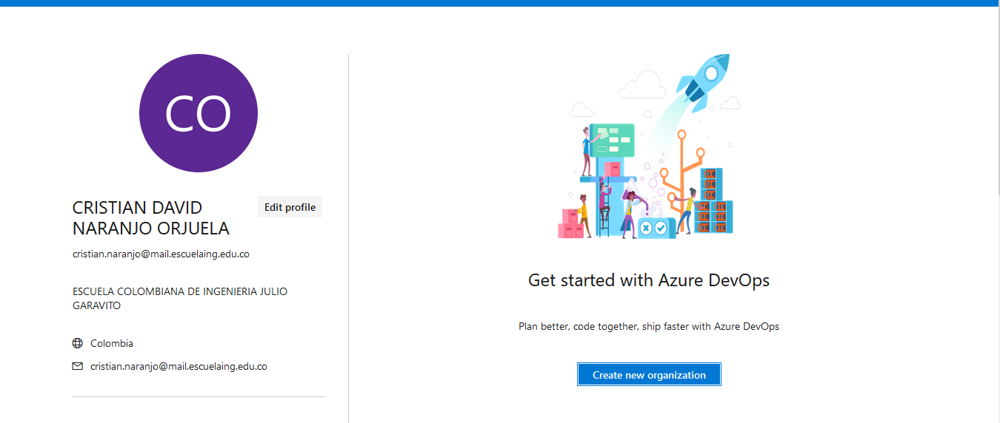
creamos el proyecto 
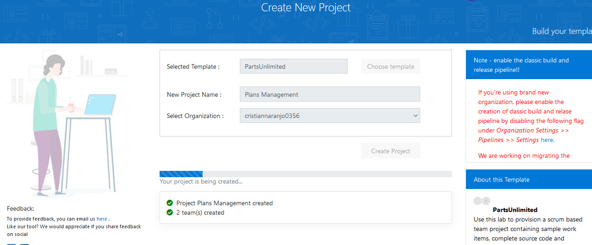
creamos un nuevo plan 
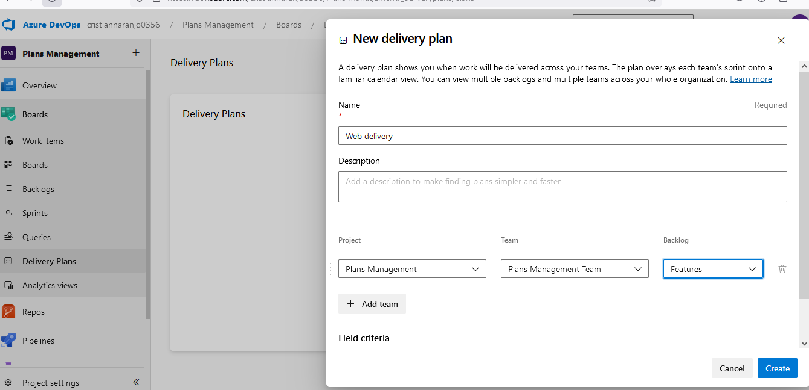
añadimos un Field criteria
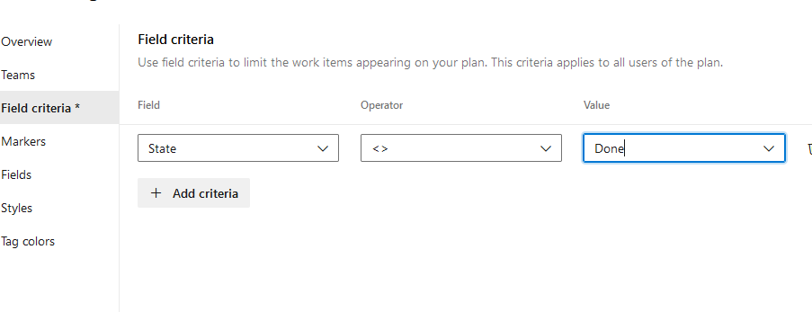
añadimos un marcador
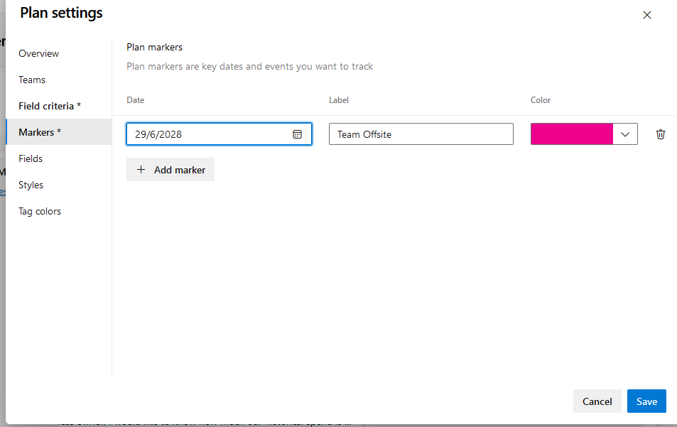
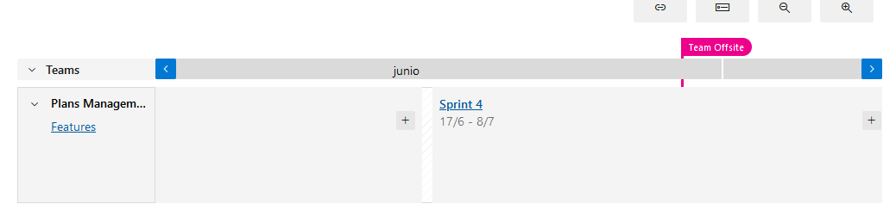

ahora vamos a añadir un equipo externo al proyecto

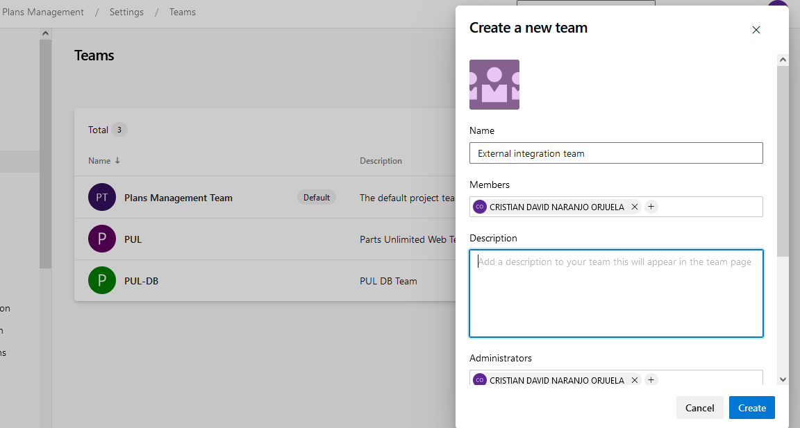

vamos a board proyect configuration y creamos dos nuevas iteraciones
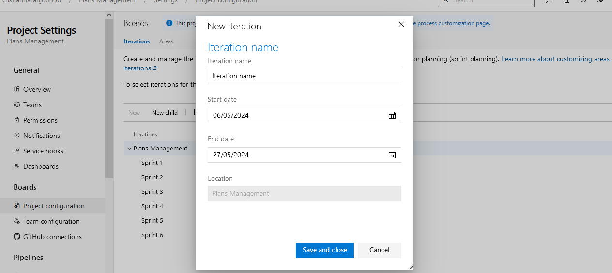

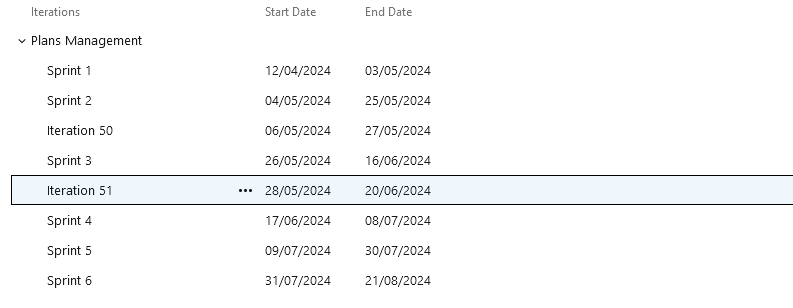
vamos al equipo y le agregamos las iteraciones creadas 
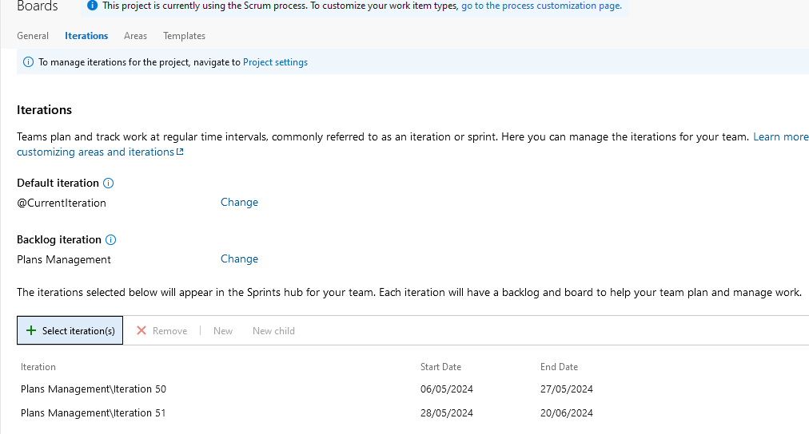
ahora vamos a teams  y añadimos un nuevo equipo 
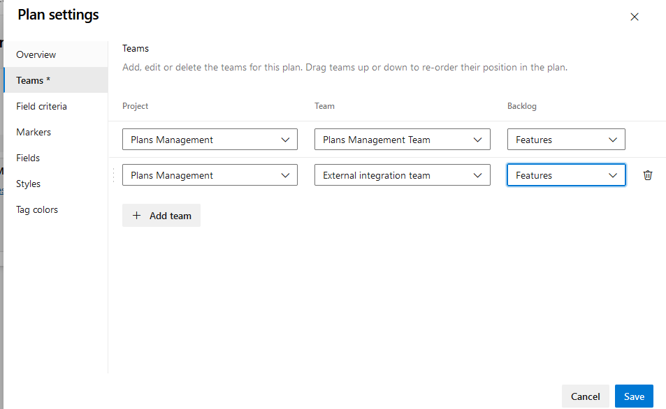
ahora podemos veer las iteraciones puestas anteriormente 
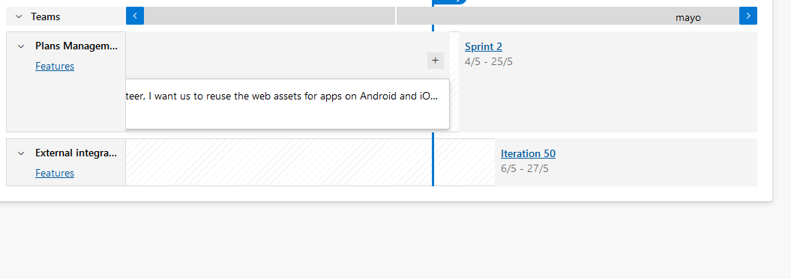
añadimos nombre a las tareas 
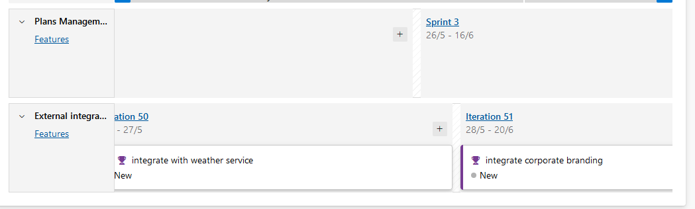
podemos cambiar de sprint las tareas 
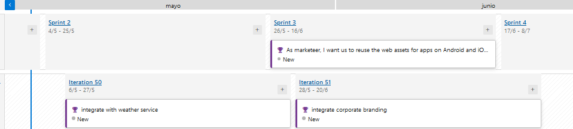
tambien se puede cambiar el zoom del sprin
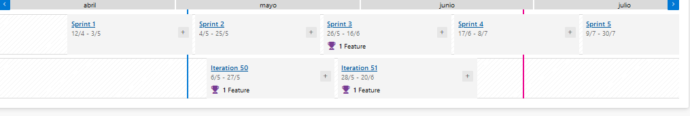

ahora vamos a  realizar un seguimiento de las dependencias 

entramos al feature del spring 1 
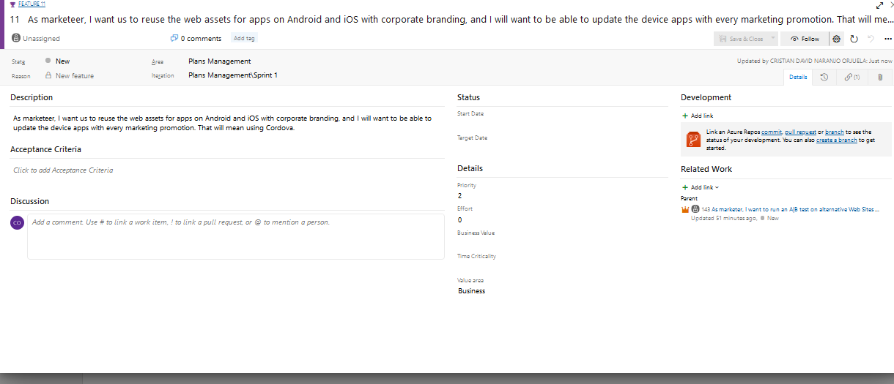
agregamos las dos que creamos y guardamos 
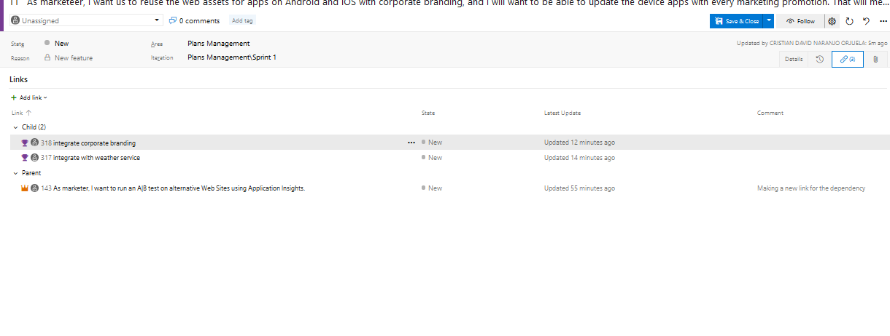

ponemos veer las dependencias creadas 
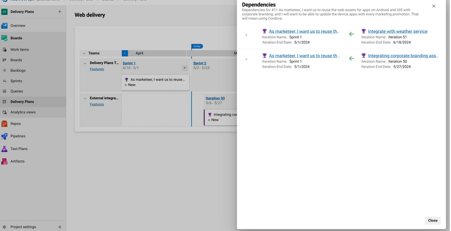